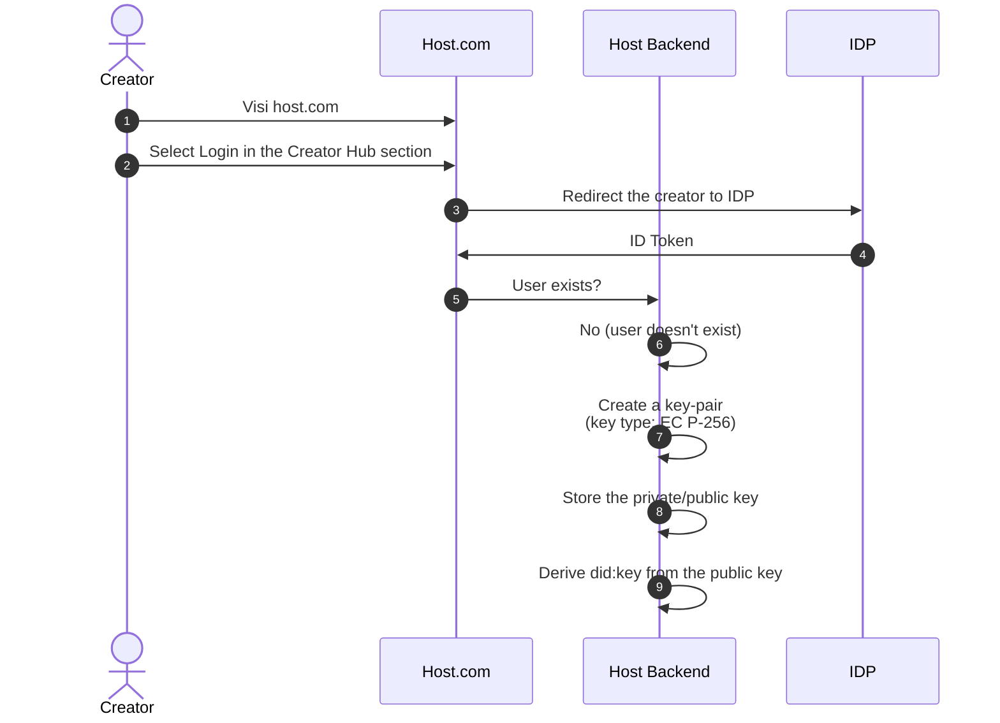

# Creator email verification

1. Visit ...
2. Visit ...
3. Visit ...
4. Visit ...
5. Visit ...
6. Visit ...
7. For key generation and management see LINK to the specs
8. How to store the keys see...
9. Derive did:key as specified in LINK to did:key

DID key contains serialised and encoded public key. DID document it trivially derived from the DID key.

- See how to define and encode/decode the public key <https://hub.ebsi.eu/vc-framework/did/did-methods/natural-person> (before implementing it, check the code below)
- Test how resolve public keys from did:key: <https://hub.ebsi.eu/tools/did-resolver>
  - See also the source code tab
