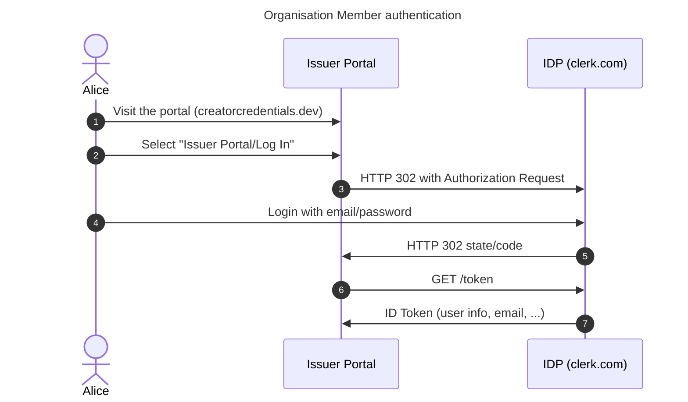

# Host - Issuer Authentication

Issuer representatives must be able to authenticate using their organisational email addresses.

Proposed solution: use a 3rd party Identity Provider (IDP) and user management system.

The sequence diagram presents a simple OIDC-based authentication flow. Implementation may differ, depending on the IDP capabilities.

Only email login should be supported since we want users to authenticate with their organisational email addresses. Login with social media is not applicable.

After the user is authenticated, it needs to perform did:web verification, else we cannot assure the user belongs to the given organisation.

NOTE: Whether the user has the right to represent the organisation is out of scope for this version.
