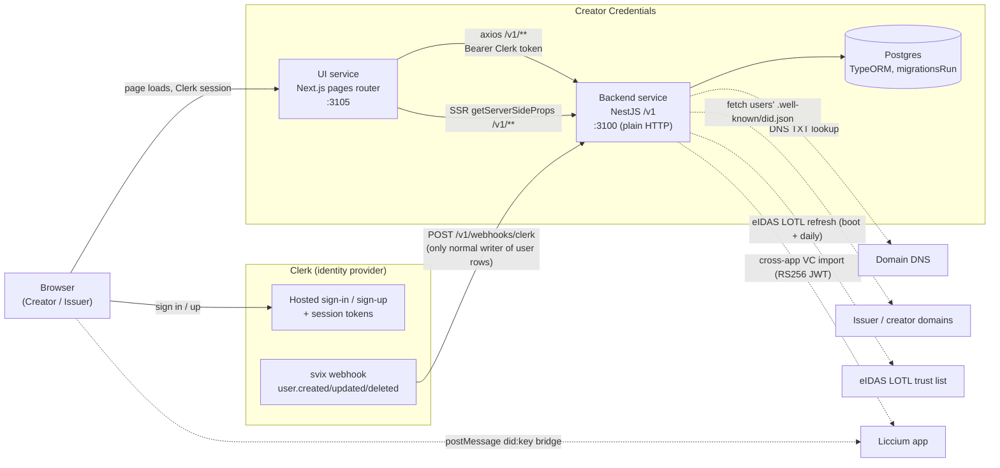

# Architecture overview

> Reflects `creator-credentials-backend` / `creator-credentials-ui` code as of 2026-08-21.

This is a map of the deployed system: the two services, how a request flows from
the browser to Postgres, and the external systems each service talks to. It is
not an endpoint-by-endpoint reference – for that, see
`08-api-reference.md`. For who the actors are (Issuer, Creator, and the
platform "Host"), see `02-roles-and-actors.md`. For how VCs are signed and the
trust store is built, see `06-signing-and-trust-model.md`.

---

## 1. The two deployed services

Creator Credentials is a two-tier app plus a shared identity provider (Clerk).

| Service | Stack | Default port | Auth | Persistence |
|---|---|---|---|---|
| **UI** (`creator-credentials-ui`) | Next.js **pages** router, React Query | `3105` (`FRONTEND_APP_PORT`) | Clerk (hosted sign-in/up) + Clerk edge middleware | none (calls the backend) |
| **Backend** (`creator-credentials-backend`) | NestJS, TypeORM | `3100` (`APP_PORT \|\| 3100`, `main.ts:31`) | Clerk session (`ClerkExpressWithAuth`) + per-route `AuthGuard` | Postgres via TypeORM |

Both are internal-facing services; there is no separate API gateway.

### Backend specifics

- **URI versioning.** `enableVersioning({ type: URI, defaultVersion: '1' })`
  (`main.ts`), so every route is served under `/v1/...`. A few controllers are
  `VERSION_NEUTRAL` (`health`, the root `AppController`) and answer without the
  prefix.
- **Plain HTTP, port 3100.** `NestFactory.create` builds a plain HTTP server and
  `app.listen(process.env.APP_PORT || 3100)` (`main.ts:31`).

  > **Stale doc/env note.** The backend README claims HTTPS-only on port **3200**,
  > and `.env.example` sets `APP_PORT=3200`, but the committed code defaults to
  > plain HTTP on **3100**. Local dev setups may add TLS on top (the UI's axios
  > clients disable certificate verification for exactly this case – see §3).
- **Raw-body gap.** The svix Clerk webhook verifies its signature over
  `req.rawBody` (`webhooks.controller.ts:42`), but `main.ts` does **not** pass
  `rawBody: true` to `NestFactory.create`, so Nest never populates that field.
  As committed, webhook signature verification cannot succeed without a
  deployment-side fix (adding `rawBody: true`).
- **Postgres via TypeORM, migrations on boot.** `TypeOrmModule.forRoot` runs with
  `synchronize: false` and **`migrationsRun: true`** (`app.module.ts:39`), so
  pending migrations auto-apply at startup. Entities are auto-globbed
  (`**/*.{entity,repository}.{js,ts}`, `app.module.ts:40`). See
  `09-data-model.md` for the schema.

### Identity provider (Clerk)

Clerk is the **shared identity provider** for the whole system. The UI mounts
Clerk's hosted `<SignIn>` / `<SignUp>` components and gates protected pages with
Clerk edge middleware; the backend validates the same Clerk session on every
`/v1` request.

**The app does not create its own user rows in the request path.**
User provisioning is driven by a **svix-verified Clerk webhook**
(`POST /v1/webhooks/clerk`), which is the **only normal writer of `user` rows**.
The webhook handles `user.created` / `user.updated` / `user.deleted`, and defers
row creation until Clerk metadata carries the terms-acceptance fields (see
`02-roles-and-actors.md` for the terms gate and role resolution). A request that
arrives before the webhook has provisioned the row gets a 404 from
`GET /v1/users/check`, which also lazily back-fills the per-user cert, did:key,
and email credential.

---

## 2. Component / data-flow overview

**The core path is one line:** browser → UI → backend `/v1` → Postgres. Clerk
sits beside it as the identity provider (auth for the browser, webhook writes to
the backend). Everything else is an external touchpoint the backend or browser
reaches out to during a specific verification or import flow.

### External touchpoints

- **Domain DNS** – the backend polls DNS TXT records to confirm domain ownership
  (two `@Cron(EVERY_10_SECONDS)` pollers in `UsersService`).
- **Hosted `did.json` fetch** – for did:web verification the backend **fetches**
  a user's `.well-known/did.json` from their domain (`users.service.ts:662`).
  Note the asymmetry: the backend never **serves** its own platform `did.json`;
  the platform's `did:web:liccium.com` is a signing identity, not a hosted
  document (see `06-signing-and-trust-model.md`).
- **eIDAS LOTL** – the cert-challenge trust store loads the eIDAS List of Trusted
  Lists on boot (`OnApplicationBootstrap`) and refreshes daily
  (`@Cron(EVERY_DAY_AT_3AM)`), to validate imported issuer QSeal/QSig certs.
  Env: `EIDAS_LOTL_URL`, `EIDAS_LOTL_SIGNERS_DIR`.
- **Liccium cross-app import** – two links to the Liccium app:
  1. a browser `postMessage` bridge (`liccium-did-provide` → import → bind a
     did:key), and
  2. a **public** `POST /v1/credentials/export` endpoint authenticated by an
     RS256 JWT verified against a public key rebuilt from
     `LICCIUM_CLERK_KEYS_{KID,N,E}` (`credentials.controller.ts:283-305`).

---

## 3. The two axios instances and self-signed TLS

The UI talks to the backend through **two** axios instances, split by execution
context:

| Instance | File | Base URL (env) | Used from |
|---|---|---|---|
| Client (`nestInstance`, default export) | `src/api/axiosNest.ts` | `NEST_API_URL` / `NEXT_PUBLIC_NEST_API_URL` | all client-side request functions (`src/api/requests/*`) |
| SSR | `src/api/axiosSSRNest.ts` | `NEST_API_SSR_URL` / `NEXT_PUBLIC_NEST_API_SSR_URL` | `getServerSideProps` direct calls (e.g. `issuers/request`) |

The split exists because SSR runs server-side (inside the container /
`host.docker.internal`) while the client instance runs in the browser, so they
need different base URLs to reach the same backend.

**Self-signed TLS reality.** Both instances create their `https.Agent` with
`rejectUnauthorized: false` (`axiosNest.ts`, `axiosSSRNest.ts`), i.e. they
**accept self-signed / untrusted certificates**. This is how the UI reaches a
locally TLS-terminated backend without a trusted CA. It is a dev/self-hosted
convenience, not a production trust decision, and a production-hardening item.

**Auth header.** The legacy next-auth `getSession()` Bearer interceptor in both
files is **commented out**, so neither instance attaches a token automatically.
Requests carry only the `Authorization: Bearer <token>` that individual React
Query hooks thread in from the Clerk session (via `getHeaders(token)`).

---

## 4. What runs where / ports / CORS allow-list

| Concern | Value |
|---|---|
| UI dev server | `:3105` (`FRONTEND_APP_PORT`) |
| Backend | `:3100` plain HTTP (`APP_PORT \|\| 3100`; README/`.env.example` claim of HTTPS:3200 is stale) |
| Postgres | via TypeORM; host/port/user/password/name from `DATABASE_*` env |
| Identity provider | Clerk (hosted), webhook at `POST /v1/webhooks/clerk` |

**Backend CORS allow-list** is hardcoded in `main.ts:12-23`:

- `https://cc-backend.liccium.network`
- `https://liccium.app`
- `http://localhost:3105`
- `https://www.creatorcredentials.dev`, `https://creatorcredentials.dev`
- `https://www.creatorcredentials.app`, `https://creatorcredentials.app`

Methods: `GET,HEAD,PUT,PATCH,POST,DELETE`. Note the CORS origins are production
domains (`creatorcredentials.dev/.app`) plus `localhost:3105` for local UI dev.

**Auth layering (backend).** Requests pass through a middleware chain
(`app.module.ts:56-79`): `LogsMiddleware` → `ClerkExpressWithAuth()` → a global
gate that rejects any request without `req.auth.userId`. That gate is
`.exclude(...)`-ed for a small public set: `.well-known/*`, `health`,
`v1/mocks(/*)`, `v1/credentials/export`, and `v1/webhooks/*`. Everything else
additionally re-checks the DB user (and its role) inside the handler – there is
**no role guard**; see `02-roles-and-actors.md`.

---

## 5. Environment variables

The full env tables live in the two repo READMEs and are not duplicated here.
Point of reference:

- **Backend env** – `DATABASE_*`, `CLERK_SECRET_KEY`,
  `CLERK_WEBHOOK_SIGNING_SECRET`, VC-signing keys (`SIGNATURE_KEY_*`,
  `HALCOM_CERT_PRIVATE_KEY`), cross-app import keys
  (`LICCIUM_CLERK_KEYS_{KID,N,E}`), eIDAS (`EIDAS_LOTL_URL`,
  `EIDAS_LOTL_SIGNERS_DIR`), `CERT_SECRET_KEY`, `TERMS_AND_CONDITIONS_URL`,
  `APP_PORT`. See the backend README setup section.

  > The backend `.env.example` is partly stale: it lists keys that are **not
  > read** (`HALCOM_CERT_P12_PASSWORD`, `CREDENTIAL_X5C_HEADER`,
  > `CLERK_PUBLISHABLE_KEY`) and **omits** keys that are (`HALCOM_CERT_PRIVATE_KEY`,
  > `EIDAS_LOTL_URL`, `EIDAS_LOTL_SIGNERS_DIR`), and sets `APP_PORT=3200` where
  > code defaults to `3100`.

- **UI env** – `NEST_API_URL` / `NEST_API_SSR_URL` (+ `NEXT_PUBLIC_` twins),
  `FRONTEND_APP_PORT`, `NEXT_PUBLIC_CLERK_PUBLISHABLE_KEY`, `CLERK_SECRET_KEY`.
  See the UI README env table.

  > Several UI env vars are orphaned: `API_MOCKING`, `API_URL` /
  > `NEXT_PUBLIC_API_URL` (legacy mock base), and the `NEXTAUTH_*` vars (dead
  > next-auth).
