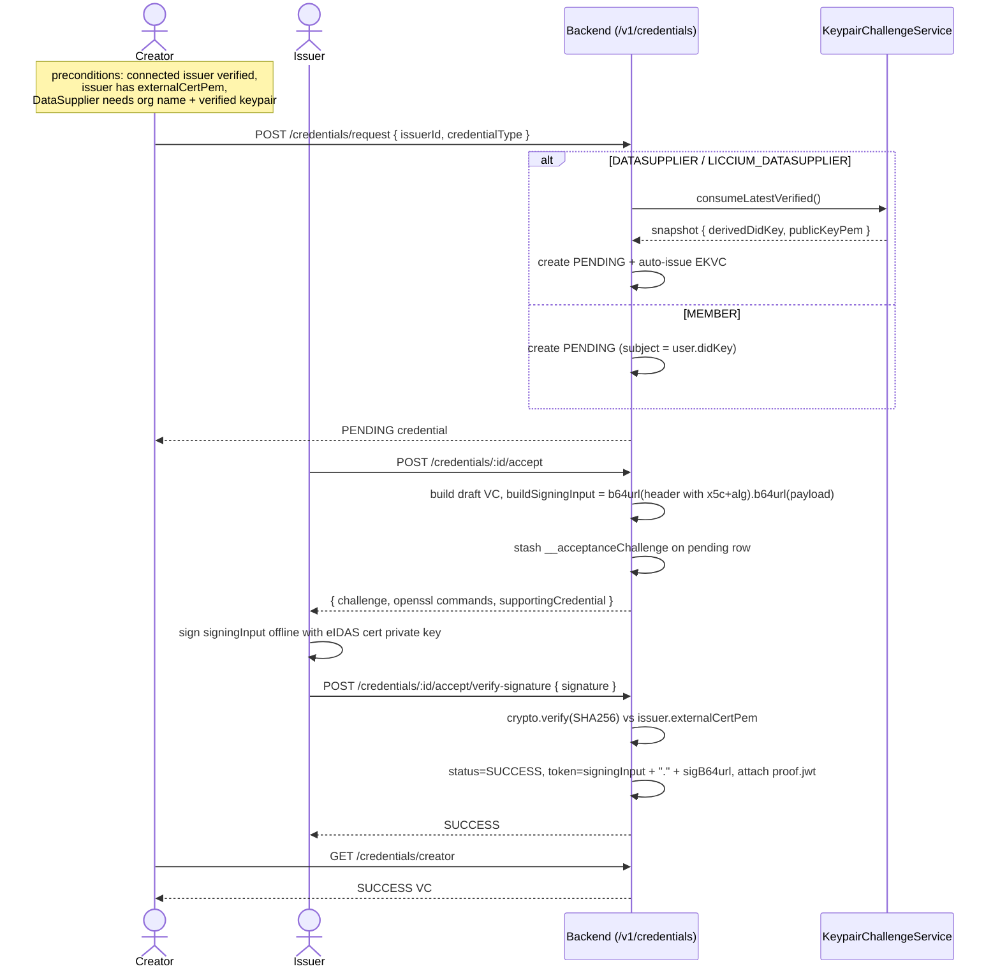

# Connections & issuance

> Reflects `creator-credentials-backend` / `creator-credentials-ui` code as of 2026-08-21.

This document covers the two flows by which an **issuer** grants a Verifiable Credential to a **creator**:

- **(a)** the creator↔issuer **connection lifecycle** (`REQUESTED → ACCEPTED / REJECTED / REVOKED`), and
- **(b)** the issuer-issued VC **state machine** (`request → PENDING → accept → verify-signature → SUCCESS`), where the issuer signs the credential offline with their eIDAS certificate.

A connection sets up the relationship between the creator and issuer; issuance then re-checks its own preconditions independently. All routes are under `/v1`; citations reference `path:line` inside `creator-credentials-backend`.

For the self-verification proofs these flows depend on (`externalCertPem`, the consumed keypair), see `07-verification-flows.md`. For the VC objects produced, see `03-verifiable-credentials-catalog.md`. For the JWS signing detail (`x5c` header, `signingInput`), see `06-signing-and-trust-model.md`. For raw HTTP contracts, see `08-api-reference.md`.

---

## Part (a) – Creator ↔ Issuer connection lifecycle

A `Connection` is a creator↔issuer relationship with status `ConnectionStatus { REQUESTED, ACCEPTED, REJECTED, REVOKED }` (`src/connections/connection.entity.ts:11-16`). The `connections` module has **no controller** – it is a pure service (`ConnectionsService`) driven by `UsersController` handlers.

### State transitions

| From | Action | Who | Endpoint | To |
|---|---|---|---|---|
| (none) | request | Creator | `POST /v1/users/issuers/:issuerId/confirm-request` | `REQUESTED` |
| `REQUESTED` | accept | Issuer | `POST /v1/users/creators/:creatorId/accept` | `ACCEPTED` |
| `REQUESTED` | reject | Issuer | `POST /v1/users/creators/:creatorId/reject` | `REJECTED` |
| `REQUESTED` / `ACCEPTED` | revoke | Issuer | `POST /v1/users/creators/:creatorId/revoke` | `REVOKED` |

Revoke applies to any live connection: `getExistingConnection` matches both `REQUESTED` and `ACCEPTED` rows (`src/connections/connections.service.ts:14-29, 82-96`). Reject throws if the connection is already `ACCEPTED` (`:130-134`).

### Sequence

1. **Creator discovers issuers.** `GET /v1/users/issuers` lists active issuers (those with ≥ 1 `credentialsToIssue`; Data Supplier issuers stay hidden until the issuer holds a cert) (`src/users/users.service.ts:333-347, 394-402`). In the UI: `/creator/issuers`, tabs Connected / Pending / Available.
2. **Creator requests.** `POST /v1/users/issuers/:issuerId/confirm-request` → `ConnectionsService.createConnection` creates a `REQUESTED` connection, rejecting a duplicate `REQUESTED` or `ACCEPTED` (`src/connections/connections.service.ts:64-80`). UI: `/creator/issuers/request?issuerId=…`.
3. **Issuer reviews.** `GET /v1/users/creators?status=PENDING` lists requesters (`CreatorVerificationStatus.Pending` maps to `ConnectionStatus.Requested`). UI: `/issuer/creators/requested`; the nav badge shows the pending count.
4. **Issuer decides.**
   - Accept → `POST /v1/users/creators/:creatorId/accept` → `acceptConnection` sets `ACCEPTED` (`src/connections/connections.service.ts:98-116`).
   - Reject → `POST /v1/users/creators/:creatorId/reject` → `REJECTED`.
   - Revoke → `POST /v1/users/creators/:creatorId/revoke` → `REVOKED`.
   - Handlers at `src/users/users.controller.ts:123-156`.
5. **Reads filter `REVOKED`** out of the relationship views (`src/users/users.service.ts:243`); `CreatorVerificationStatus.{Accepted,Pending}` map to `ConnectionStatus.{Accepted,Requested}` (`src/users/users.service.ts:264-271`).

> **Revocation semantics:** revoking a connection hides the relationship from reads but does **not** invalidate previously issued VCs. There is no status-list or cryptographic revocation, and no server-side `validUntil` enforcement. See `03-verifiable-credentials-catalog.md` §Revocation.

---

## Part (b) – Issuer-issued VC state machine

Applies to the three issuer-granted credential types: `MEMBER`, `DATASUPPLIER` (Open Future Data Supplier), and `LICCIUM_DATASUPPLIER`. The flow splits into a **request** phase (creator) and a cert-signed **accept** phase (issuer), with the credential row moving `PENDING → SUCCESS`.

Credential rows carry `credential_status ∈ { PENDING, SUCCESS, FAILED }` (`src/credentials/credential.entity.ts`). A partial-unique index enforces one PENDING row per `(user, credential_type)`.

### Preconditions

Checked in `POST /v1/credentials/request` (`src/credentials/credentials.controller.ts:186-277`):

- Caller has the **creator** role.
- `credentialType ∈ { MEMBER, DATASUPPLIER, LICCIUM_DATASUPPLIER }`.
- The issuer **exists and is verified**: `domain || didWeb || externalCertPem` is present (`credentials.controller.ts:211`).
- The issuer's offer list (`credentialsToIssue`) includes the requested type.
- The issuer has **`externalCertPem`** – otherwise `400` (the cert is required to sign the credential later; see `07-verification-flows.md` flow 5).
- **DATASUPPLIER** additionally requires `user.organizationName` on the creator and a **consumed verified keypair** (the external EC-P256 proof from `07-verification-flows.md` flow 4).
- **LICCIUM_DATASUPPLIER** requires the consumed keypair but no org name.

### Request phase (creator)

1. `POST /v1/credentials/request` `{ issuerId, credentialType }`. After the guards above, the issuer's VC `issuer` value is resolved from the issuer cert (`resolveIssuerDidFromCert`).
2. Branch by type:
   - **MEMBER:** `createPendingMembershipCredential` with subject = `user.didKey` (no keypair challenge) → PENDING row (`src/credentials/credentials.service.ts:501-533`).
   - **DATASUPPLIER:** require `user.organizationName`; `consumeLatestVerified` (keypair flow); `createPendingDataSupplierCredential` snapshots the keypair and auto-issues the **EKVC** (`EXTERNAL_KEYPAIR_VERIFICATION`) supporting VC (`src/credentials/credentials.service.ts:641-710`).
   - **LICCIUM_DATASUPPLIER:** `consumeLatestVerified`; `createPendingLicciumDataSupplierCredential` (+ EKVC, no org name) (`src/credentials/credentials.service.ts:819-887`).

The pending row stashes transient JSON on `credential_object`: `__keypairSnapshot` (the consumed did:key + PEM) and later `__acceptanceChallenge` (the draft VC + signing input). Both are stripped when a credential is returned as a supporting credential (`src/credentials/credentials.service.ts:632-634, 810-812`), and verify-signature replaces the whole object with the clean draft VC (`:1021`).

### Accept phase (issuer, cert-signed)

3. `POST /v1/credentials/:credentialId/accept` → `getPendingCredentialType` dispatches to the matching `initiate…Acceptance` (`src/credentials/credentials.controller.ts:468-491`). It:
   - Builds the draft VC (subject `id` = the snapshotted keypair did:key `??` `user.didKey`).
   - Computes `signingInput = base64url(header{x5c, alg}).base64url(payload)`, where `alg` is `ES256` for an EC cert or `RS256` otherwise (`buildSigningInput`, `src/credentials/credentials.service.ts:1048-1064`).
   - Stashes it as `__acceptanceChallenge` on the pending row.
   - Returns `{ challenge, commands: [openssl dgst -sha256 -sign …], supportingCredential }`. `supportingCredential` is the EKVC for the Data Supplier types.
4. The issuer runs the returned `openssl` command with their eIDAS cert's private key and obtains a base64 signature. **The private key never touches the backend** – signing is offline.
5. `POST /v1/credentials/:credentialId/accept/verify-signature` `{ signature }` → `executeSignatureVerification`: `crypto.createVerify('SHA256').verify(issuer.externalCertPem public key, sig)`. On success it sets `SUCCESS`, `credentialObject = challenge.credentialObject`, `token = <signingInput>.<base64url(signature)>` (a full compact JWS), and attaches `proof.jwt` (`src/credentials/credentials.service.ts:988-1029`).
6. The creator reads the resulting `SUCCESS` VC via `GET /v1/credentials/creator` (`src/credentials/credentials.controller.ts:116-183`).

**Teardown:** `POST /v1/credentials/:id/reject` or `DELETE /v1/credentials/:id` (issuer-only) deletes the pending/issued row (`removeMemberCredential`, `src/credentials/credentials.controller.ts:521-544`).

### State diagram

| Credential status | Trigger | Next |
|---|---|---|
| (none) | `POST /credentials/request` (guards pass, `consumeLatestVerified` for Data Supplier) | `PENDING` |
| `PENDING` | `POST /credentials/:id/accept` (build draft VC + signingInput challenge) | `PENDING` (challenge stashed) |
| `PENDING` | `POST /credentials/:id/accept/verify-signature` (valid sig) | `SUCCESS` |
| `PENDING` | invalid signature | remains `PENDING` (409 `ConflictException`) |
| `PENDING` / `SUCCESS` | `POST /credentials/:id/reject` or `DELETE /credentials/:id` | row deleted |

### Handshake sequence

---

## Cross-app import from the Liccium app

A creator who already holds credentials in the Liccium app can import them into Creator Credentials via a public, JWT-authenticated path rather than re-running the flows above.

- `POST /v1/credentials/export` (public – excluded from the Clerk middleware gate) `{ token }`, an RS256 JWT verified with a public key rebuilt from `LICCIUM_CLERK_KEYS_{KID,N,E}` (`src/credentials/credentials.controller.ts:283-305`).
- It extracts `email` + `licciumDidKey` from the token, looks the user up via the Clerk Admin API (`GET api.clerk.dev/v1/users?email_address=`, Bearer `CLERK_SECRET_KEY`, `credentials.controller.ts:344-366`), re-issues the **Connect** VC binding the CC did:key ↔ `licciumDidKey`, and returns the creator's `SUCCESS` email/domain/membership/connect VCs (`credentials.controller.ts:383-464`).

> **Known issue:** the domain / connect (and out-of-scope wallet) branches gate on `emailCredential[0].credentialStatus` rather than each credential's own status (`src/credentials/credentials.controller.ts:435-461`).

Full detail belongs with the API reference – see `08-api-reference.md`. The Connect VC shape is in `03-verifiable-credentials-catalog.md`.

---

## Related documents

- `03-verifiable-credentials-catalog.md` – the Member / DataSupplier / LicciumDataSupplier / EKVC / Connect VC objects.
- `07-verification-flows.md` – the `externalCertPem` and consumed-keypair proofs these flows depend on.
- `06-signing-and-trust-model.md` – the `x5c` JWS signing input and the eIDAS trust model.
- `08-api-reference.md` – per-endpoint HTTP contracts, including `/credentials/export`.
