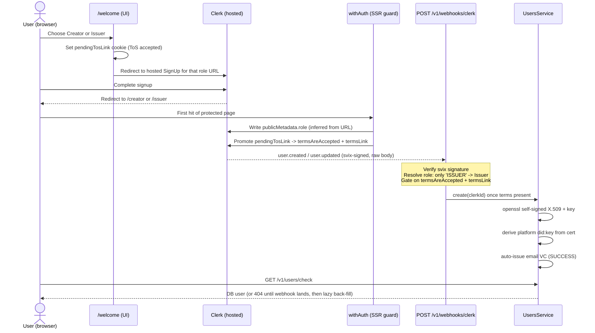

# Authentication & provisioning

> Reflects `creator-credentials-backend` / `creator-credentials-ui` code as of 2026-08-21.

This document specifies how a user signs in, how their role is decided, and how a
backend `User` row (with its per-user certificate and did:key) comes to exist. It
is the current, code-grounded account of authentication and supersedes two older
spec-repo documents (now retired) that described designs which never shipped:

- `host-issuer-authentication.md` (retired) – described an OIDC / IdP redirect
  sequence with a host-generated issuer keypair. The product uses **Clerk**
  hosted auth, not OIDC.
- `other/user-journeys.md` (retired) – described username/password and
  social-login onboarding with email-confirmation codes. None of that exists;
  there are no custom credential forms and no password/social flows outside Clerk.

Related docs: [`02-roles-and-actors.md`](02-roles-and-actors.md) (platform vs
Issuer vs Creator), [`06-signing-and-trust-model.md`](06-signing-and-trust-model.md)
(the per-user cert + did:key that provisioning mints), and
[`08-api-reference.md`](08-api-reference.md) (the webhook and `users/check`
endpoints).

## 1. Clerk is the sole live identity provider

There is exactly one live authentication mechanism: **Clerk**. Sign-in and
sign-up are Clerk's hosted components (`<SignIn>`, `<SignUp>`, `<UserProfile>`) –
never custom forms. Two other mechanisms appear in the tree but are not app
login:

- **next-auth** is legacy and dead. Its plumbing is entirely commented out: the
  `getSession()` + `Bearer` interceptor in `axiosNest.ts` and `axiosSSRNest.ts`
  is a no-op, so client requests carry only the Clerk token the caller threads in.
  The `/auth/signin/email` (spinner only) and `/auth/error` pages are inert, and
  the package is still installed but unused (`package.json`).
- **MetaMask** is a wallet-ownership proof that mints a Wallet credential, not a
  session. It is out of scope here; see [`07-verification-flows.md`](07-verification-flows.md).

There is **no verifier authentication surface** anywhere: no VC-presentation
login, no authorization-request endpoint, no verifier role in either repo.

### Frontend wiring

- `ClerkProvider` wraps the whole app with `signInUrl="/welcome"` /
  `signUpUrl="/welcome"` (`_app.tsx:45-48`).
- **Edge middleware** (`src/middleware.ts`) runs `clerkMiddleware` with
  `isProtectedRoute = ['/creator(.*)', '/issuer(.*)']` (`src/middleware.ts:4`).
  Unauthenticated or unauthorized requests are redirected to `/welcome`
  (`src/middleware.ts:12-21`). The matcher is scoped to `/creator*` + `/issuer*`
  (`src/middleware.ts:27-36`); public surfaces (`/`, `/welcome`, `/auth/*`) are
  not gated.
- **SSR guard** `withAuth` wraps `getServerSideProps` on every protected page
  (`src/components/modules/app/withAuth.ts`). It reads the Clerk `userId`, fetches
  the user via `clerkClient()`, and redirects when there is no user. It is also
  where the role is assigned and where ToS is promoted (§2).

## 2. Two roles, chosen by signup URL

The role model is a single two-value enum: `ClerkRole { Issuer = 'issuer',
Creator = 'creator' }` (`user.entity.ts:19-22`). There is **no "pick a role"
screen**. The role is chosen implicitly by *which signup/login URL* the user
takes from `/welcome`, then made durable server-side.

`withAuth` is the single source of role truth on the frontend:

1. If Clerk `publicMetadata.role` is neither `Creator` nor `Issuer`, it infers
   the role from the URL (`.includes('issuer')` / `.includes('creator')`) and
   writes it to Clerk `publicMetadata.role` (`withAuth.ts:37-55`).
2. It promotes the `pendingTosLink` cookie – set by the signup pages to
   `config.CREATOR_TERMS_URL` or `config.ISSUER_TERMS_URL` – into
   `publicMetadata.termsAreAccepted` + `termsLink`, so the backend webhook can
   verify terms acceptance (`withAuth.ts:59-72`).
3. `options.roles` enforces role-eligibility on each protected page, redirecting
   a mismatched user to their own home (`withAuth.ts:74-89`).

On the backend side, the webhook resolves the role from Clerk metadata:
`public_metadata.role ?? unsafe_metadata.role`, and **only the literal
`'ISSUER'` maps to `Issuer`** – everything else becomes `Creator`
(`webhooks.service.ts:128-135`). The role is stored on the `user.clerk_role`
column (default `creator`, `user.entity.ts` / §Data model).

> The frontend `UserRole` enum is upper-case (`CREATOR` / `ISSUER`, stored in
> Clerk `publicMetadata.role`; `src/shared/typings/UserRole.ts`); the backend
> `getUser` response carries the lower-case DB `ClerkRole` (`issuer` /
> `creator`). They describe the same role in two casings.

## 3. Backend provisioning via the Clerk webhook

User rows are **not** created by the frontend. The only writer of new `User` rows
in normal operation is the Clerk webhook.

- `POST /v1/webhooks/clerk` is **public** – excluded from the global auth gate
  (`app.module.ts:56-78`) – and verifies the **svix** signature with
  `CLERK_WEBHOOK_SIGNING_SECRET` over the **raw** request body
  (`webhooks.controller.ts:24-54`). Raw-body access requires
  `NestFactory.create(..., { rawBody: true })`, which `main.ts` does **not**
  currently set – see the raw-body gap noted in
  [`01-architecture-overview.md`](01-architecture-overview.md).
- The controller dispatches `user.created` / `user.updated` / `user.deleted`
  (`webhooks.service.ts:38-52`).

### Terms-acceptance gate

A DB user is created **only once** Clerk metadata carries both
`termsAreAccepted` **and** `termsLink`. If those are absent at `user.created`
time, creation is **deferred** to a later `user.updated` event
(`webhooks.service.ts:66-74, 84-102`). This is why `withAuth` must promote the
`pendingTosLink` cookie into Clerk metadata (§2) – it is the signal the webhook
gates on.

### Per-user cert + did:key minting at creation

When the gate passes, `WebhooksService.handleUserCreated` resolves role, email,
and name, then calls `UsersService.create` (idempotent on `clerkId`, handling the
23505 unique-violation race, `users.service.ts:125-172`). Creation then runs
`generateCertAndDidKey` (`users.service.ts:73-123`):

- `CertificatesService` shells out to `openssl` (via a bundled script) to mint a
  **self-signed per-user X.509 certificate + private key** (365-day,
  `certificates.service.ts:75`).
- The platform **did:key** is derived from that certificate's public key
  (`publicKeyPemToDid`).
- An **email VC** is auto-issued `SUCCESS` for the new user from Clerk's verified
  primary email (`CredentialsService.createEmailCredential`,
  `users.service.ts:167`).

Details of the cert/did:key and the signing paths they feed are in
[`06-signing-and-trust-model.md`](06-signing-and-trust-model.md).

### The `users/check` back-fill

`GET /v1/users/check` is the frontend's "get me" call. It is **not**
`AuthGuard`-protected; it reads `req.auth.userId` directly, returns 404 if the
webhook has not yet provisioned the row, and lazily back-fills the cert, did:key,
and email credential if `certificate509Buffer` is null
(`users.controller.ts:37-56`). This covers the race where the frontend loads
before the webhook has landed.

## 4. Two-layer backend authorization

Once provisioned, every request is authorized in two layers:

1. **Global Clerk middleware gate.** `ClerkExpressWithAuth()` populates
   `req.auth`; an inline gate throws `UnauthorizedException` whenever
   `req.auth.userId` is absent (`app.module.ts:62-69`). `.exclude(...)` opens up
   only `.well-known/*`, `health`, `v1/mocks(/*)`, `v1/credentials/export`, and
   `v1/webhooks/*`. Every other route requires a valid Clerk session **before**
   per-route guards run.
2. **Per-route `AuthGuard`.** Applied with `@UseGuards(AuthGuard)`
   (`src/users/guards/clerk-user.guard.ts`), it loads the DB `User` by
   `req.auth.userId` and attaches it as `req.user`; it returns `false` if no DB
   row exists. `@GetUser()` then injects that `User` into handlers.

There is **no role guard or role decorator.** Role is enforced by handlers
re-checking `user.clerkRole` themselves and throwing
`NotFoundException('This api is only for ...')` on a mismatch. So the
authoritative role check for any issuer-only or creator-only operation lives in
the handler, not in a guard.

> `POST /v1/credentials/export` is the one authenticated route outside this model:
> it is excluded from the middleware gate and authenticates instead with an
> RS256 JWT rebuilt from `LICCIUM_CLERK_KEYS_{KID,N,E}`
> (`credentials.controller.ts:283-305`) – the Liccium-app → Creator-Credentials
> cross-app import path. See [`08-api-reference.md`](08-api-reference.md).

## 5. Signup → role → provisioning sequence

