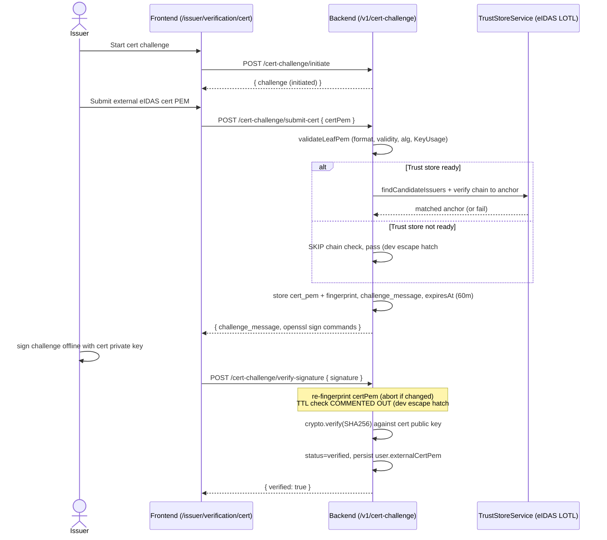

# Verification flows

> Reflects `creator-credentials-backend` / `creator-credentials-ui` code as of 2026-08-21.

This document describes the **self-verification** methods a creator or issuer completes to prove control of an identifier (email, domain, did:web, external keypair) or possession of an eIDAS certificate. Each of these is a proof the user drives about *themselves*; the issuer-to-creator issuance handshake is a separate flow covered in `04-connections-and-issuance.md`.

All backend routes are served under `/v1` (URI versioning, `defaultVersion: '1'`). Every route below sits behind the global Clerk auth gate and, unless noted, the per-route `AuthGuard`. Citations reference `path:line` inside `creator-credentials-backend`.

For the shape of each resulting Verifiable Credential (subject, proof type, signing key), see `03-verifiable-credentials-catalog.md`. For the platform signing keys and the eIDAS trust store, see `06-signing-and-trust-model.md`. For the raw HTTP contract of each endpoint, see `08-api-reference.md`.

## Summary

| # | Flow | Actor | Cron poll? | VC yielded | Proof type |
|---|---|---|---|---|---|
| 1 | Email | Creator or Issuer | no | `EMAIL` | auto (trust Clerk) |
| 2 | Domain (DNS TXT) | Creator or Issuer | yes (10s) | `DOMAIN` | RS256 platform x5c |
| 3 | did:web (well-known) | Issuer | yes (10s) | `DID_WEB` | ES256 |
| 4 | External EC-P256 keypair | Creator | no | none directly (ephemeral, consumed at issuance) | `crypto.verify` challenge |
| 5 | Issuer eIDAS certificate | Issuer | no | none (persists `externalCertPem`) | `crypto.verify` challenge |

---

## 1. Email verification (automatic)

Email is verified on the Clerk side; the backend trusts Clerk's primary email and never runs its own email challenge. The email VC is auto-issued for every provisioned user, creator or issuer.

**UI entry point:** none. The credential is present on first sign-in and shown on `/creator/verification` (issuer side: `/issuer/verification`) via `EmailVerificationCard` (fed by `GET /v1/credentials/creator` / `.../issuer`).

**Backend sequence:**

1. Clerk fires `user.created` → `POST /v1/webhooks/clerk` (public, svix-verified over the raw body, `src/webhooks/webhooks.controller.ts:24-54`).
2. On user creation, `CredentialsService.createEmailCredential` auto-issues an **EMAIL** VC with `SUCCESS` status (`src/webhooks/webhooks.service.ts` → `UsersService.create`). A partial-unique index enforces one EMAIL credential per user (`src/credentials/credential.entity.ts`, migration `1778458122354`).
3. `GET /v1/users/check` is the frontend's "get me" call. It reads `req.auth.userId` directly (no `AuthGuard`), 404s if the webhook has not yet provisioned the row, and **lazily back-fills** the cert, did:key, and email credential if `certificate509Buffer` is null (`src/users/users.controller.ts:37-56`).

`POST /v1/credentials/create/email` exists for explicit self-issue, but the normal path is fully automatic (`src/credentials/credentials.controller.ts:51`).

**Yields:** an `EMAIL` VC, status `SUCCESS`.

---

## 2. Domain-name verification (DNS TXT + 10s cron)

Proves control of a domain by publishing a random TXT record. Used by both creators (`/creator/verification/domain`) and issuers (`/issuer/verification/domain`); the flow is identical, only the `userRole` differs.

**UI entry point:** `/creator/verification/domain` or `/issuer/verification/domain`.

**Backend sequence:**

1. `POST /v1/users/verification/domain/txt-record` `{ domain }` → `receiveAndUpdateDomainRecord` generates a random record already prefixed `cc-verification=` (`generateDomainRecord`, `src/shared/helpers.ts:41-45`; prefix in `src/credentials/credentials.constants.ts:1`), stores it on `user.domain_record`, and returns `{ txtRecord }` to publish as-is (`src/users/users.service.ts:506-527`).
2. The user adds the TXT record at their DNS provider.
3. `POST /v1/users/verification/domain/confirm` → `confirmDomainRecordCreated` writes a **PENDING** `DOMAIN` credential, sets `domain_pending_verifcation` [sic – column typo], and arms polling (`src/users/users.service.ts:529-541`).
4. `@Cron(EVERY_10_SECONDS) checkUserDomains` resolves the domain's TXT records via `dns.resolveTxt`, looks for the exact stored record, and on match calls `createDomainCredential` (RS256, platform `x5c`, status `SUCCESS`) and clears the pending flag (`src/users/users.service.ts:554-591`).
5. `POST /v1/users/domain/disconnect` deletes the credential and clears the fields.

**Yields:** a `DOMAIN` VC, status `SUCCESS` (RS256 with the platform x5c chain – see `06-signing-and-trust-model.md`).

---

## 3. did:web verification (well-known `did.json` + 10s cron)

Proves control of a domain by hosting a generated `did.json` at `/.well-known/did.json`. This is an issuer-onboarding flow.

**UI entry point:** `/issuer/verification/didweb`.

**Backend sequence:**

1. `POST /v1/users/verification/did-web/well-known` `{ didWeb }` → `receiveAndUpdateDidWebWellKnown` generates the `did.json` (`generateWellKnownForDidWeb`), stores it on `user.did_web_well_known`, and returns the JSON string for the issuer to host at `https://<didWeb>/.well-known/did.json` (`src/users/users.service.ts:606-630`).
2. The issuer uploads the returned document to `/.well-known/did.json` on their domain.
3. `POST /v1/users/verification/did-web/confirm` → `confirmDidWebWellKnownCreated` writes a **PENDING** `DID_WEB` credential and arms verification (`src/users/users.service.ts:632-643`).
4. `@Cron(EVERY_10_SECONDS) checkUsersDidWeb` fetches the hosted `did.json` and compares `verificationMethod[0].publicKeyJwk.x` to the stored value; on match it calls `createDidWebCredential` (ES256, status `SUCCESS`) and clears the pending flag (`src/users/users.service.ts:645-719`).
   - The fetch is made with **`rejectUnauthorized: false`** and a 9-second timeout (`src/users/users.service.ts:664, 668`). Disabling TLS certificate validation on the outbound fetch is a production-hardening item – see `06-signing-and-trust-model.md`.
5. `POST /v1/users/did-web/disconnect` deletes the credential and clears the fields.

**Yields:** a `DID_WEB` VC, status `SUCCESS` (ES256).

> Domain onboarding for issuers is flow 2 above; any one of `domain`, `didWeb`, or `externalCertPem` satisfies the "issuer has verified himself" precondition consumed by issuance (`src/credentials/credentials.controller.ts:211`).

---

## 4. External EC-P256 keypair challenge (ephemeral, single-use)

The creator proves control of an **external EC P-256 keypair** they intend to use for signing data. The verified key is **never persisted on the `User`** – it is ephemeral and consumed at credential-request time to bind a Data Supplier VC (see `04-connections-and-issuance.md`, Part (b)).

**UI entry point:** the in-wizard `CredentialsRequestVerifyKeypair` (step 3 of the credential request wizard, only for `EXTERNAL_KEYPAIR` / `LICCIUM_EXTERNAL_KEYPAIR` templates) plus the `KeypairVerification*` modules. The standalone `/creator/verification/keypair` and `/issuer/verification/keypair` pages are redirect stubs.

**Backend sequence** (`src/keypair-challenge/`):

1. `POST /v1/keypair-challenge/initiate` wipes any prior in-progress and verified rows (enforcing single-use), creates an `initiated` row, and returns openssl EC-P256 keygen commands (`keypair-challenge.service.ts:53-74`).
2. `POST /v1/keypair-challenge/submit-public-key` `{ publicKeyPem }` validates the key is EC P-256, stores the PEM, derives a `did:key:z...` via `publicKeyPemToDid`, issues a random `challengeMessage`, and sets status `challenge_issued` (`keypair-challenge.service.ts:76-111`).
3. The creator signs the challenge offline with the private key. `POST /v1/keypair-challenge/verify-signature` `{ signature }` → `crypto.createVerify('SHA256').verify(...)` against the stored PEM; on success sets status `verified` and returns `{ verified: true, didKey }`. **The verified key is intentionally NOT written to the user record** – it stays on the challenge row only (`keypair-challenge.service.ts:113-151`).
4. At credential-request time, `consumeLatestVerified` atomically flips the verified row to `consumed` and snapshots `{ derivedDidKey, publicKeyPem }` onto the pending credential (`keypair-challenge.service.ts:173-200`). This is the point at which the proof is bound into a Data Supplier VC.

**Supporting endpoints:**

- `GET /v1/keypair-challenge/status` – latest challenge; surfaces a verified-but-unconsumed did:key (`keypair-challenge.controller.ts:24`).
- `GET /v1/keypair-challenge/did-key-pem?did=` – reconstructs the PEM from a `did:key:z...`, rejecting legacy hash-format DIDs (`keypair-challenge.controller.ts:30-46`).
- `POST /v1/keypair-challenge/reset`, `DELETE /v1/keypair-challenge/external-key`.
- `PATCH /v1/keypair-challenge/active-source` – a **no-op** kept only for API compatibility (`keypair-challenge.controller.ts:88`).

**Yields:** no VC directly. When consumed at issuance it produces the auto-issued `EXTERNAL_KEYPAIR_VERIFICATION` supporting VC ("EKVC") alongside the Data Supplier credential – see `04-connections-and-issuance.md` and `03-verifiable-credentials-catalog.md`.

---

## 5. Issuer eIDAS certificate challenge (trust-store validation + sign challenge)

An issuer imports an **external eIDAS QSeal/QSig X.509 certificate** and proves possession of its private key. Success persists `user.externalCertPem`, which is the signing key later used to accept and sign creator credential requests (`04-connections-and-issuance.md`).

**UI entry point:** `/issuer/verification/cert` (page titles here are hardcoded English, not i18n).

**Backend sequence** (`src/cert-challenge/`):

1. `POST /v1/cert-challenge/initiate` deletes non-terminal rows and creates an `initiated` row (`cert-challenge.service.ts:53-66`).
2. `POST /v1/cert-challenge/submit-cert` `{ certPem }` → `CertValidatorService.validateLeafPem`:
   - Format parse, validity window, algorithm allowlist (SHA-256/384/512; RSA ≥ 2048; EC P-256/384/521), and KeyUsage (`digitalSignature | nonRepudiation`) (`validation/cert-validator.service.ts:55-190`).
   - **eIDAS chain check:** `TrustStoreService.findCandidateIssuers` by issuer DN, then `cert.verify({ publicKey: anchor, signatureOnly })` against each candidate LOTL anchor. The leaf must chain **directly** to an anchor – no intermediates (`validation/cert-validator.service.ts:85-127`).
   - **Dev escape hatch #1:** if the trust store is not `ready`, chain validation is **skipped and the cert passes** (`validation/cert-validator.service.ts:78-83`, "skipping eIDAS chain validation (dev/test mode)"). Must be closed before production.
   - On success: store `cert_pem` + SHA-256 `cert_fingerprint`, a random `challenge_message`, `expiresAt` (60-minute TTL), status `challenge_issued`; return the openssl sign commands (`cert-challenge.service.ts:68-99`).
3. The issuer signs `challenge_message` offline with the cert's private key. `POST /v1/cert-challenge/verify-signature` `{ signature }`:
   - Re-fingerprints `challenge.certPem` and aborts if it changed since submit (anti-race guard, `cert-challenge.service.ts:125-140`).
   - `crypto.createVerify('SHA256').verify(...)` against the cert's public key.
   - **Dev escape hatch #2:** the TTL / expiry check is **commented out** ("Expiry check disabled for dev/testing – re-enable in production", `cert-challenge.service.ts:110-117`). Must be re-enabled before production.
   - On success: status `verified`, and `user.externalCertPem` is persisted (`cert-challenge.service.ts:156-166`).
4. Trust-store lifecycle: `TrustStoreRefreshService` refreshes on `OnApplicationBootstrap` (non-blocking) and daily via `@Cron(EVERY_DAY_AT_3AM)`; `EidasPipelineService.collectAnchors` walks the EU **LOTL** to per-country **TL** pointers, XAdES-verifies each (`xadesjs`), and collects QSeal/QSig CA anchors, refusing to publish an empty store (`trust-store/trust-store.refresh.ts`, `eidas/eidas-pipeline.service.ts`). See `06-signing-and-trust-model.md` for detail.
5. `PATCH /v1/cert-challenge/active-source` toggles `platform` / `external` signing source; `DELETE /v1/cert-challenge/external-cert` removes the cert and resets to platform. `GET /v1/cert-challenge/status` self-heals `externalCertPem` from a verified challenge if the user column was never written (`cert-challenge.service.ts:32-43`).

**Yields:** no VC. Persists `user.externalCertPem`, the precondition for issuing Member / DataSupplier / LicciumDataSupplier VCs.

---

## Related documents

- `03-verifiable-credentials-catalog.md` – the VC objects produced by these flows.
- `04-connections-and-issuance.md` – the connection lifecycle and issuer-to-creator VC issuance that consume these proofs.
- `06-signing-and-trust-model.md` – platform signing keys and the eIDAS trust store.
- `08-api-reference.md` – per-endpoint HTTP contracts.
