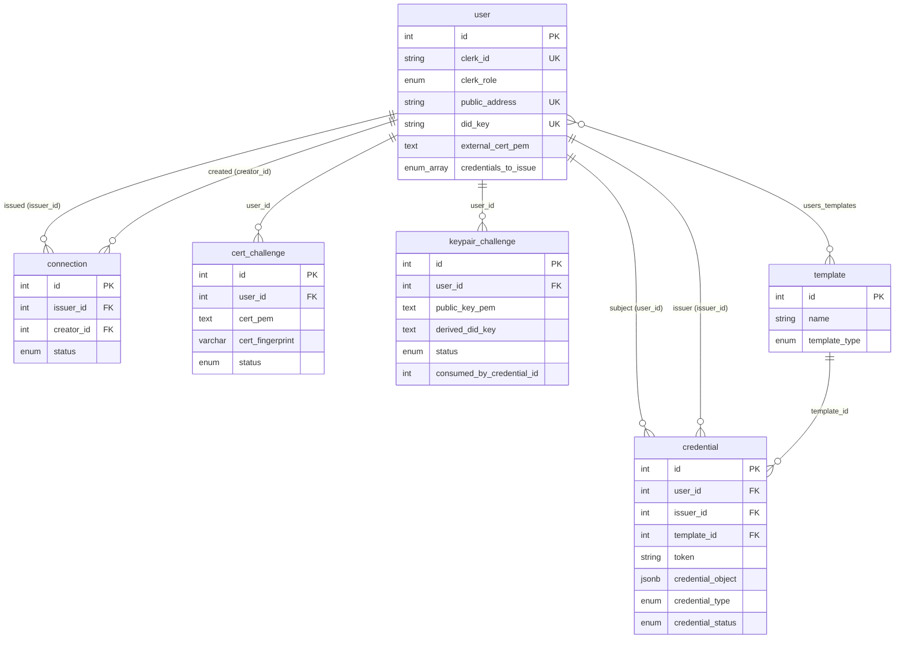

# Data model

> Reflects `creator-credentials-backend` code as of 2026-08-21.

This document is the schema-level reference for the Creator Credentials backend (NestJS + TypeORM + Postgres). It covers the six persisted tables, their columns and constraints, the enums that populate them, and how the tables relate. For what the credentials *mean* and how they are issued, see [`03-verifiable-credentials-catalog.md`](03-verifiable-credentials-catalog.md); for the endpoints that read and write these rows, see [`08-api-reference.md`](08-api-reference.md).

Reconstructed from the entity classes (`src/**/*.entity.ts`) and the migration history (`src/migrations/`), verified against code as cited.

---

## Entities

### `user` (`src/users/user.entity.ts`)

The central identity record. One row per Clerk user, provisioned by the Clerk webhook (never by the frontend). PK `id` (serial).

| Column | Type | Notable defaults / constraints |
|---|---|---|
| `clerk_id` | varchar | **unique, not null** – the Clerk user id |
| `nonce` | varchar | default `''`; excluded from serialization; wallet-signing nonce |
| `clerk_role` | enum `ClerkRole` | default `creator` |
| `public_address` | varchar | **unique**, nullable – MetaMask/EVM address (Wallet/MetaMask – out of scope for this doc set) |
| `description` | varchar | not null, default text |
| `name` | varchar | not null, default `'Default name'` |
| `image_url` | varchar | not null, default `'/images/brand.svg'` |
| `credentials_to_issue` | enum `CredentialType[]` (array) | not null; entity default `[]`, `'{}'` in the migration SQL – issuer's VC offer list |
| `domain` | varchar | **unique**, nullable |
| `domain_record` | varchar | nullable; excluded – DNS TXT challenge value |
| `domain_pending_verifcation` | boolean | not null, default false *(column name is misspelled in schema)* |
| `did_key` | varchar | **unique, not null** – platform `did:key` (derived from self-signed cert) |
| `liccium_did_key` | varchar | **unique**, nullable – Liccium-app binding |
| `did_web` | varchar | **unique**, nullable |
| `did_web_well_known` | jsonb | nullable; excluded – hosted `did.json` snapshot |
| `did_web_pending_verifcation` | boolean | not null, default false *(misspelled)* |
| `external_did_key` | varchar | **unique**, nullable |
| `external_public_key_pem` | text | nullable |
| `active_did_key_source` | varchar | not null, default `'platform'` |
| `external_cert_pem` | text | nullable – verified issuer eIDAS cert |
| `active_signing_cert_source` | varchar | not null, default `'platform'` |
| `certificate_509_buffer` | bytea | nullable; excluded – platform self-signed cert |
| `certificate_private_key` | bytea | nullable; excluded – platform cert private key |
| `organization_name` | varchar | nullable, default null |
| `terms_link` | varchar | nullable, default null |
| `did_web_well_known_changed_at` | timestamp | not null, default `CURRENT_TIMESTAMP`; excluded |
| `domain_record_changed_at` | timestamp | not null, default `CURRENT_TIMESTAMP`; excluded |
| `nonce_changed_at` | timestamp | not null, default `CURRENT_TIMESTAMP`; excluded |
| `created_at` / `updated_at` | timestamp | managed |

**Relations** (`user.entity.ts:39-162`):

- OneToMany `credentials` (as subject, `credential.user_id`) – *eager*.
- OneToMany `issuedCredentials` (as issuer, `credential.issuer_id`) – *eager*.
- ManyToMany `templates` via the `users_templates` join table – *eager*.
- OneToMany `issuedConnections` + `createdConnections` (as issuer / creator) – *eager*.
- OneToMany `keypairChallenges`, `certChallenges` (lazy).

> The two `*_pending_verifcation` columns are misspelled in the schema (`verifcation`). This is the real column name and is load-bearing; do not "fix" it without a migration (`user.entity.ts:100-125`).

### `credential` (`src/credentials/credential.entity.ts`)

One row per issued or pending Verifiable Credential. PK `id` (serial).

| Column | Type | Notable defaults / constraints |
|---|---|---|
| `email` | varchar | **not null** – overloaded "credential value" field: it stores the email for EMAIL VCs and is reused as a generic value for other credential types; TODO to rename (`credential.entity.ts:23`) |
| `token` | varchar | not null – the JWS/JWT proof |
| `credential_object` | jsonb | not null – the raw W3C VC 2.0 object |
| `issuer_id` | int (FK → `user.id`) | nullable; excluded relation |
| `user_id` | int (FK → `user.id`) | not null – the subject; excluded relation |
| `value` | varchar | nullable |
| `template_id` | int (FK → `template.id`) | nullable |
| `credential_type` | enum `CredentialType` | not null, default `EMAIL` |
| `credential_status` | enum `CredentialVerificationStatus` | not null, default `PENDING` |
| `created_at` / `updated_at` | timestamp | managed |

**Uniqueness (partial indexes, migration `1778458122354`):**

- `idx_credential_unique_email` – at most one `EMAIL` row per `user_id` (any status).
- `idx_credential_unique_domain` – at most one `DOMAIN` row per `user_id` (any status).
- `idx_credential_unique_pending` – at most one `PENDING` row per `(user_id, credential_type)` for all types except `EMAIL` / `DOMAIN`. Once a pending row resolves to `SUCCESS` (or is rejected), another of the same type may be requested.

> The pending accept flow stashes transient JSON on `credential_object` – `__keypairSnapshot` (the verified `did:key` captured at request time) and `__acceptanceChallenge` (the signing input + draft VC). Both are stripped when the credential is returned as a supporting credential (`credentials.service.ts:632-634, 810-812`), and verify-signature replaces the whole object with the clean draft VC (`:1021`).

### `connection` (`src/connections/connection.entity.ts`)

The creator↔issuer relationship. PK `id` (serial). No timestamps.

| Column | Type | Notable defaults / constraints |
|---|---|---|
| `issuer_id` | int (FK → `user.id`) | relation `issuedConnections` |
| `creator_id` | int (FK → `user.id`) | relation `createdConnections` |
| `status` | enum `ConnectionStatus` | default `REQUESTED` |

(Introduced by migration `1710970800329-add-connection`.) `REVOKED` connections are filtered out of creator↔issuer reads but do **not** invalidate already-issued VCs.

### `template` (`src/templates/template.entity.ts`)

A named credential-offer template. PK `id` (serial).

| Column | Type | Notable defaults / constraints |
|---|---|---|
| `name` | varchar | not null |
| `template_type` | enum `CredentialTemplateType` | not null, default `MEMBER` |

**Relations:**

- ManyToMany `users` via `users_templates` (join columns `template_id` / `user_id`).
- OneToMany `credentials` (`credential.template_id`).

### `cert_challenge` (`src/cert-challenge/cert-challenge.entity.ts`)

Tracks an issuer proving possession of an external eIDAS X.509 certificate's private key. PK `id` (serial).

| Column | Type | Notable defaults / constraints |
|---|---|---|
| `user_id` | int (FK → `user.id`) | not null |
| `cert_pem` | text | nullable – submitted certificate |
| `cert_fingerprint` | varchar(64) | nullable – SHA-256 fingerprint (anti-race between submit and verify) |
| `challenge_message` | text | nullable – random message the issuer signs |
| `expires_at` | timestamp | nullable – 60-min TTL *(written but not enforced; see [`06-signing-and-trust-model.md`](06-signing-and-trust-model.md) §3)* |
| `status` | enum `cert_challenge_status_enum` | default `initiated` |
| `current_step` | int | default 1 |
| `verified_at` | timestamp | nullable |
| `created_at` / `updated_at` | timestamp | managed |

Status values: `initiated`, `challenge_issued`, `verified`, `failed`. (Migrations `1776940418356-add-cert-challenge`, `1777560023071-cert-challenge-update`.)

### `keypair_challenge` (`src/keypair-challenge/keypair-challenge.entity.ts`)

Tracks a creator proving possession of an external EC P-256 keypair (used as the subject key for DataSupplier VCs). The verified result is **ephemeral and single-use** – never written onto `user`; it is consumed at credential-request time. PK `id` (serial).

| Column | Type | Notable defaults / constraints |
|---|---|---|
| `user_id` | int (FK → `user.id`) | not null |
| `public_key_pem` | text | nullable – submitted EC P-256 public key |
| `derived_did_key` | text | nullable – `did:key:z…` derived from the public key |
| `challenge_message` | text | nullable |
| `status` | enum `keypair_challenge_status_enum` | default `initiated` |
| `current_step` | int | default 1 |
| `verified_at` | timestamp | nullable |
| `consumed_at` | timestamp | nullable |
| `consumed_by_credential_id` | int | nullable – the credential that consumed this proof |
| `created_at` / `updated_at` | timestamp | managed |

Status values: `initiated`, `challenge_issued`, `verified`, `consumed`, `failed`. (Migrations `1776283060511-add-keypair-challenge`, `1777561204579-keypair-challenge-consumed`.)

---

## Enums

Canonical definitions live in `src/shared/typings/`.

**`CredentialType`** (`CredentialType.ts`) – DB values:
`EMAIL`, `WALLET` (Wallet/MetaMask – out of scope for this doc set), `MEMBER`, `DATASUPPLIER`, `LICCIUM_DATASUPPLIER`, `STUDENT`, `DOMAIN`, `DID_WEB`, `CONNECT`, `EXTERNAL_KEYPAIR_VERIFICATION`.

> `STUDENT` is defined in the enum but has **no builder and no create/request path** – it is dead/future (see [`03-verifiable-credentials-catalog.md`](03-verifiable-credentials-catalog.md) §STUDENT – Planned / not implemented).

**`CredentialVerificationStatus`** (`CredentialVerificationStatus.ts`):
`PENDING`, `SUCCESS`, `FAILED`. (Stored on `credential.credential_status`.)

**`CredentialTemplateType`** (`CredentialTemplateType.ts`):
`MEMBER`, `STUDENT`, `EXTERNAL_KEYPAIR`, `LICCIUM_EXTERNAL_KEYPAIR`. (Stored on `template.template_type`.)

**`ConnectionStatus`** (`connection.entity.ts:11-16`, the DB truth):
`REQUESTED`, `ACCEPTED`, `REJECTED`, `REVOKED`. (Stored on `connection.status`.)

**`ClerkRole`** (`user.entity.ts:19-22`):
`issuer`, `creator`. (Stored on `user.clerk_role`, default `creator`.)

### API-facing view enums (not stored)

These are projections used in request filters and response payloads; they are mapped to/from the DB enums, not persisted.

**`IssuerConnectionStatus`** (`IssuerConnectionStatus.ts`) – how a creator sees an issuer relationship:
`NOT_STARTED`, `PENDING`, `CONNECTED`.

**`CreatorVerificationStatus`** (`CreatorVerificationStatus.ts`) – the `?status=` filter on `GET /users/creators`:
`PENDING`, `ACCEPTED`. Mapped to `ConnectionStatus`: `PENDING → REQUESTED`, `ACCEPTED → ACCEPTED` (`users.service.ts:264-271`).

---

## Entity–relationship diagram

The `users_templates` join table (columns `user_id`, `template_id`) backs the ManyToMany between `user` and `template`.

---

## Migrations

- TypeORM runs with **`synchronize: false`** and **`migrationsRun: true`** (`src/app.module.ts:38-39`): the schema is never auto-diffed against entities; migrations under `src/migrations/` are applied in timestamp order **on every boot**. Entities are auto-globbed via `**/*.{entity,repository}.{js,ts}` (`src/app.module.ts:40`).
- A standalone `typeorm.config.ts` DataSource (globbing from `dist/`) drives the CLI for generating/running migrations outside the app process.
- Column-level truth is therefore the migration files, not the entity decorators, where the two could diverge – the entity decorators above match the applied migrations as of this revision.
